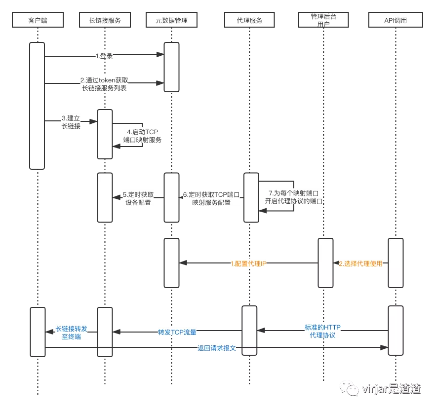

# Echo架构原理

Echo的本质，就是一个通过长链接进行报文转发的分布式系统，通过在多个终端维护和中心服务的长链接隧道，使得echo系统有能力通过多个不同的ip出口发送socket报文。另一方面，echo在上游实现各种proxy协议，在底层则转化为简单的socket链接、报文转发、心跳维持、shell远端执行等基础任务。此时通过echo系统可以完成选定终端ip出口发送任意tcp/udp报文。echo可以用在爬虫抓取、风控对抗等对ip出口有限制的业务场景中。

# 1 echo子服务
Echo按照模块划分有如下子服务，完成各自规定的任务
1. EchoClient
2. EchoNatServer
3. EchoHttpProxyServer
4. EchoMetaServer

## 1.1 EchoClient
EchoClient是部署在终端的客户端，Echo系统最终的网络流量需要借助EchoClient向外部发送。EchoClient可以部署在任意网络环境下，如手机、电脑、服务器、硬件终端等。他使用Echo的标准协议接入到Echo集群中。

### 1.1.1 EchoClient职责

1. 代理Echo中心服务发送和接受报文，主要包括tcp/udp，代理中心服务创建tcp/udp socket链接对象(不考虑报文内容，EchoClient可以自主实现第四层协议的拆包和合并包)
2. 长链接会话保持，登录拉取Echo中心服务的配置，使用Echo私有协议接入中心服务，保持和Echo中心的长链接。如果监测到链接断开或者无响应，需要断开重连。所以Client存在本身的心跳任务
3. 远程控制，EchoClient协议中定义了远程控制相关内容。中心服务可以通过长链接隧道下发一些特殊指令（字符串形式），EchoClient需要解析、执行、响应。实现诸如：ip重播、设备重启、文件拉取、shell命令执行等。EchoClient sdk层没有详细定义何种命令执行何种操作，需要用户手动实现这一块的协议的执行任务(android端目前存在自动的一些任务封装，用来实现飞行模式的自动重播)
4. 隧道资源HA，EchoClient和服务器的链接，可能存在服务器资源性能、服务器下线等情况发生。在集群模式下，EchoClient会至少和两台中心服务建立长链接隧道。此时如果服务器端发生宕机，EchoClient可以通过其他长链接隧道进行代理转发。

### 1.1.2 EchoClient的存在形式

一般情况，按照运行环境确定客户端寻在形态。如下:

1. jar包（sdk）：此种形式是Echo官方支持的SDK形式，通过SDK集成到其他环境中，所以还需要用户自己通过SDK二次开发。好处则是方便开发开发更多的自定义功能，以及满足各种Echo官方不支持的场景。jarSDK支持任意java环境，SDK版本设定到java1.8。基于此，您可以把SDK内嵌到发布的java程序中，内嵌到任意AndroidApp中
2. AndroidApp：EchoClient默认为Android端开发了一个客户端： https://git.virjar.com/echo/ip-app ，他是基于JarSDK开发的一个独立app，运行app则可以独立提供出口ip。AndroidApp使用的ReactNative（RN）进行开发，buidAndroidApp需要了解RN相关知识(独立编译请让你们公司的大前端同学，或者Android开发进行App构建)
3. PC脚本：此种方式也是基于jarSDK进行的二次包装开发，不过运行在JVM环境下。由于Java的跨平台特性，PC脚本形式支持Windows、MAC、Linux三大主流PC平台。PC脚本形式则会自动完成多平台适配，且配置PC脚本的开机启动启动和进程守护能力。实现EchoClient的自动，永久运行。
4. c++版本（开发中），EchoClient根据Echo的通信协议使用libevent实现c++版本的跨平台SDK。这个分支的sdk拥有更加良好的跨设备能力，当然由于是c++的，使用难度更高。c++可以嵌入到树莓派、路由器等嵌入式环境下，兼容更加苛刻的运行环境。

目前c++版本的sdk还在开发过程中，其余版本均已经完善。

## 1.2 EchoNatServer
NatServer是Echo系统的内部中间层，主要职责是完成内网穿透协议的实现，完成和Client的链接隧道。也即通过这一层实现client的网络映射到Echo服务器的某个可访问端口上。可以理解为，在tcp/ip层面。只要往EchoNatServer的端口发送数据包，那么这些数据包将会同步在Client上面重放，同理client接受到的数据包，也会在EchoNatServer返回。EchoNatServer属于Echo内部系统资源，考虑带宽、CPU、稳定性等问题，EchoNatServer是存在多台的。少部分EchoNatServer下线之后，整体Echo集群依然可以良好工作。

EchoNatServer在调度层面，会被EchoMetaServer管理，主要向EchoMetaServer同步自身的配置数据、映射资源、链接的client资源等。作为服务器，他还会和提供给EchoClient进行长链接隧道会话保持。另一方面，他还提供了一套内部的Echo会话层（类似https和ssl的关系），用来给各种代理协议进行编程使用。EchoHttpProxyServer就是基于这个会话层协议进行编程实现的。

按照计算机网络OSI七层模型，EchoNatServer的编程API层工作在第6层（会话层）。所以他是一个标准的协议层抽象，理论上EchoNatServer可以实现任意TCP/UDP的协议的代理。甚至如果出现了某些特定的新的网络协议，EchoNatServer都是可以二次编程实现他的代理(比如http3.0 quick协议，底层基于UDP。目前还没有关于http3.0的代理方案出现，但是我们可以非常轻松的自己实现一个私有的http3.0代理协议，当然客户端需要做一些简单改造了)

## 1.3 EchoHttpProxyServer

EchoHttpProxyServer是http/sockts代理协议的具体实现，前端实现标准的http/sockts代理，后端对接EchoNatServer。这个模块难度不大，但是可能业务复杂一些，这一层需要实现用户鉴权、流量控制、http/https/sockts代理标准等逻辑。

当然EchoHttpProxyServer也是一个可以动态增加或者减少（弹性伸缩）的服务。你可以架设多台EchoHttpProxyServer组建集群，实现高可用和任务分摊。

## 1.4  EchoMetaServer
EchoMetaServer则是整个代理服务的心脏，他是echo的元数据管理服务。EchoMetaServer底层有数据库(mysql)，实现用户登录注册、设备信息管理、代理资源上报和用户代理资源拉取等运维功能。EchoMetaServer使用http提供标准服务，同样可以部署多台，使用ng做负载均衡。EchoMetaServer也有前端模块（使用ReactNative实现）。客户正常登录网站看到的界面便是来自于EchoMetaServer子服务。

当然，网站后台、登录注册并不是EchoMetaServer和核心功能。EchoMetaServer最重要的任务是完成EchoNatServer和EchoHttpProxyServer和EchoClient的关系调度。EchoClient、EchoNatServer、EchoHttpProxyServer在echo集群下都是可以有很多个节点的。从代理隧道层面来说，每个EchoHttpProxyServer的代理服务资源将会映射一个EchoNatServer、然后再映射一个EchoClient资源。同时一个EchoClient资源会映射两个EchoNatServer、EchoHttpProxyServer（用来实现高可用）。所以到底那个资源和那个资源进行映射关系绑定、如何满足绑定资源一致性、如何保证映射分布是平均的（不平均会导致部分服务负载高）。这些都是EchoMetaServer进行计算和进行管理的。

另一方面，由于EchoMetaServer的定义就是数据管理，它并不能直接参与到代理请求转发过程中(否则会有较高的转发延时)。EchoMetaServer的整个管理过程都是异步+心跳和其他模块进行通信的。

## 1.5 各个组建之间的交互流程总结

### 1.5.1 Client登录

客户端(脚本、内嵌SDK、app等)接入Echo系统首先需要进行登录流程，登录的主要目的是和EchoMetaServer进行协商，获取可以注册的EchoNatServer资源。所以首先Client通过http协议进行登录操作，之后可以得到一个MetaServer返回的操作token。

再然后EchoClient根据整个token去EchoMetaServer拉取EchoNatServer配置(EchoMetaServer根据clientId，和当前系统存在的EchoNatServer资源进行计算，降EchoNatServer的host:port下发给Client)。

EchoClient拿到host:port列表之后，对每个服务器资源进行EchoNat长链接协议建立。和EchoNatServer的长链接通道建立完成之后，这个客户端资源就注册到Echo服务中了。Client将会完成EchoServer的所有报文转发任务。

### 1.5.2 EchoNatServer 内部代理服务启用

EchoNatServer在完成和EchoClient的链接建立之后，会同步的在服务器上面开放一个端口监听。这个端口和Client进行唯一绑定，此时Echo系统便拥有了一个内部私有代理资源了。在之后EchoNatServer会把开放端口监听信息推送给EchoMetaServer。在统一的注册中心注册EchoNatServer端口资源。完成注册之后管理员就可以在Echo后台看到这个资源上线了。

### 1.5.3 EchoHttpProxyServer 为这个客户端开放代理服务
EchoHttpProxyServer通过定时任务的方式，在EchoMetaServer拉取配置，主要是根据EchoHttpProxyServer的serverId拉取刚刚上报的EchoNatServer端口资源。当然EchoMetaServer会在这个拉取过程中进行资源分配，确定那些端口资源需要被那些EchoHttpProxyServer进行使用。

EchoHttpProxyServer在拉取到EchoNatServer资源之后，会为每个资源开放一个http/https/sockts标准代理协议的端口（当然内部要完成这两组资源的映射）。并且（做好准备）开始接受用户的代理请求，完成端口开放之后EchoHttpProxyServer会把代理开放信息推送给MetaServer，EchoMetaServer会把这些信息记录到数据库。EchoHttpProxyServer前端实现标准代理协议协议，后端完成和EchoNatServer的会话层握手，之后进行流量转发。

### 1.5.4 代理ip配置数据下发给代理使用用户

这一步很简单，Echo服务在那些服务器上面有那些端口开放了代理服务，都存储在MetaServer的数据库中。当代理使用用户需要使用代理资源的时候，可以通过Echo网站后台，或者通过http API提取到对应的代理配置。之后代理使用用户可以降代理配置到浏览器、手机、代码中。这一步就是普通的代理ip资源使用流程，在各大代理ip供应商那里都有demo。

### 1.5.4  代理使用用户代理请求发送和响应

当代理ip配置到代理使用用户那里，且开始发送http报文的时候，根据代理协议标准。EchoHttpProxyServer将会收到代理请求握手报文。EchoHttpProxyServer在解析了握手报文之后，知道需要向那个服务器创建tcp链接。然后使用Echo私有代理协议，完成和他映射的EchoNatServer的握手。之后建立一个和EchoNatServer的透明隧道。

在之后当http/https的真实报文发送过来之后，由于EchoHttpProxyServer已经和EchoNatServer建立了一对一的透明隧道。流量直接转发给EchoNatServer。EchoNatServer同样有一个一对一的Client资源映射，EchoNatServer原样将数据转发给EchoClient。同样，由于三端一对一映射关系，最终服务器数据返回的时候。也会按照发送数据的顺序，返回给EchoHttpProxyServer。EchoHttpProxyServer则返回给代理使用用户。

